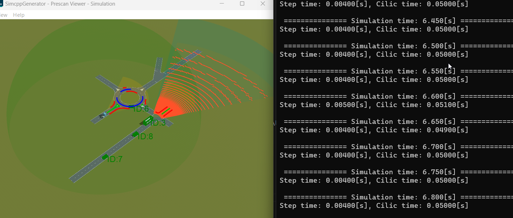
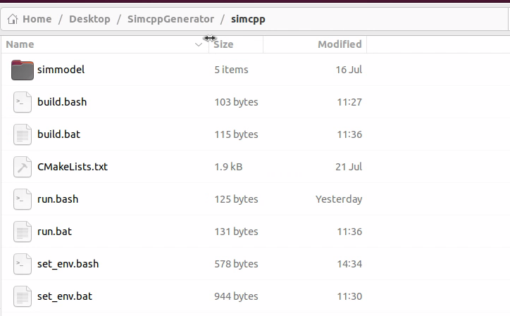
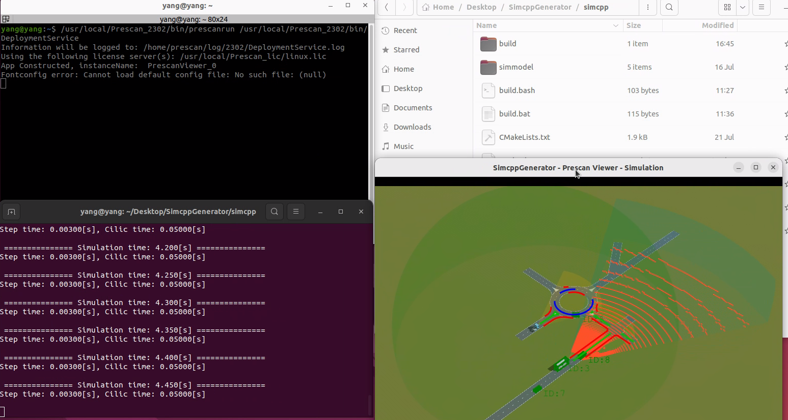

---
html:
  embed_local_images: true
#   toc: true
---


<div style="text-align: center"><span style="font-family: Arial; font-size: 20px;"><strong>—————————————————————————————</strong></span></div>
<div style="text-align: center"><span style="font-family: Arial; font-size: 20px;"><strong>Welcome to PrescanSimCppGenerator 1.1</strong></span></div>
<div style="text-align: center"><span style="font-family: Arial; font-size: 20px;"><strong>—————————————————————————————</strong></span></div>

---

For a better view of the help docment, please download and read the [README.html](README.html)

[toc]

# Introduction
Prescan Simcpp Generator aims to provide a auto-generator for Prescan SimCPP project so that user can easily generate the C++ codes, build and run the simulation. Now, the following parts are supported for generation:
<div id="introduction"></div>

- [X] Buffer
- [ ] DummySimulationModel
- [X] ISimulation
- [X] ISimulationLogger
- [X] ISimulationModel
- [ ] ManualSimulation
- [X] Simulation
- [X] Unit
- [X] AirSensorUnit
- [X] AlmsSensorUnit
- [ ] BrsSensorUnit
- [X] CameraSensorUnit
- [X] DepthCameraSensorUnit
- [ ] ImageSegmentationSensorUnit
- [X] CollisionDetectionUnit
- [X] LmsSensorUnit
- [ ] LidarSensorUnit
- [ ] ObjectCameraSensorUnit
- [X] ObjectListProviderUnit
- [X] PcsSensorUnit
- [ ] RadarSensorUnit
- [ ] TisSensorUnit
- [ ] TrafficSignalSensorUnit
- [ ] ExternalControllerUnit
- [ ] OscStateActuatorUnit
- [X] PathUnit
- [X] SpeedProfileUnit
- [ ] UltrasonicSensorUnit
- [X] AmesimVehicleDynamicsUnit
- [ ] RayCastUnit
- [ ] WheelContactUnit
- [X] StateActuatorUnit
- [X] SelfSensorUnit
- [ ] PhysicsBasedCameraUnrealControlUnit
- [ ] PhysicsBasedCameraUnrealExposureUnit
- [ ] PhysicsBasedCameraUnrealRainOverlayUnit
- [ ] PhysicsBasedCameraUnrealUnit
- [ ] PhysicsBasedCameraUnrealSensorUnit
- [X] PhysicsBasedCameraUnrealRGBUnit
- [ ] PhysicsBasedCameraUnrealDistanceUnit
- [ ] PhysicsBasedCameraUnrealImageSegmentationUnit
- [ ] PhysicsBasedCameraUnrealOpticalFlowUnit
- [ ] PhysicsBasedCameraUnrealIlluminanceUnit
- [X] PhysicsBased Fullwaveform Lidar
- [X] PhysicsBased Point Cloud Lidar
- [ ] PhysicsBased Radar

# Version

1. The project is for Prescan 2307 and higher version.
2. The project is developed and tested based on Prescan 2302 with full functionalities(all features enabled).
3. The generator supports both Windows and Ubuntu.
4. For those Prescan with some feature disabled, user may need to do some modifications to the generator source codes before you can correctly use it.

# Statement
This project is not officially released by Siemens Prescan, which is only for user learning and reference.

# Support
==**NOTE**==, for any issues you meet with when using this generator, please firstly contact the Prescan support engineer or you can submit your issue on Siemens Support Center. Please DON'T send any emails to Prescan official Support Team directly, otherwise you won't have any response to your question. 


# GetStart
## Prerequisites
Before you start with this project, make sure you've installed the following softwares:
* Prescan 2302 or higher
* Python 3.8 or higher，with following packages：
  * pip install pyyaml
* C/C++ compiler(tested with Visual Studio 2019 on Windows and GCC on Linux)
* CMake 3.21 or higher

## Environment Vars
<div id="set_env.bat"></div>

### Windows
According to installation of Prescan on your machine, you may need to do the following configurations：
1. First change the vars in ```set_env.bat```，add the Prescan path ```Prescan_path``` as well as Plugins path;
2. add dependencies to ```PATH```, if you don't have all plugins installed on your system, **==please comment out thoese not installed plugins in the bat file.==**
2. Set Prescan CMake path to ```Prescan_DIR```；
3. If there is no python interpreter in your system path, you may need to specify a python by adding it to ```PATH```. If you have python in system path, please ignore and delete this step.
4. Add Prescan python/modules/plugins directories to ```PYTHONPATH```, which you can find in Prescan installation folder；
5. Set the Prescan experiment directory to ```experiment_dir```;
6. Set the Prescan experiment pb file path to ```experiment_pb```;
7. ```simcpp_dir``` is the destination foler where you want to put the generated simcpp project. Typically, you can set it to a 'simcpp' folder in the ```%experiment_dir%```. So set it to ```"%experiment_dir%\\simcpp"```

Finally it looks like this：

```powershell
@ECHO OFF
setlocal

set "Prescan_path=D:\Simcenter Prescan\Prescan_2307"
set "Prescan_plugin_path=D:\Simcenter Prescan\Prescan_2307\Plugins"

:::: add Prescan modules and plugin dependency path(please comment out(::) these plugins which are not installed on your machine)
set "PATH=%PATH%;%Prescan_path%\bin;%"
set "PATH=%PATH%;%Prescan_plugin_path%\FullWaveformLidarPlugin\bin;"
set "PATH=%PATH%;%Prescan_plugin_path%\PBRadarPlugin\bin;"
set "PATH=%PATH%;%Prescan_plugin_path%\PointCloudLidarPlugin\bin;"
set "PATH=%PATH%;%Prescan_plugin_path%\ProbabilisticSensorsPlugin\bin;"
set "PATH=%PATH%;%Prescan_plugin_path%\PhysicsBasedCameraUnreal;"
set "PATH=%PATH%;%Prescan_plugin_path%\V2XPlugin\bin;"

:::: add cmake config path
set "Prescan_DIR=%Prescan_path%\lib\cmake"

:::: if you have python in system, please ignor and delete it
set "PATH=D:\Python38\Scripts\;D:\Python38\;%PATH%"

:::: add Prescan python API path
set "PYTHONPATH=%PYTHONPATH%;%Prescan_path%\python;"
set "PYTHONPATH=%PYTHONPATH%;%Prescan_path%\modules;"
set "PYTHONPATH=%PYTHONPATH%;%Prescan_plugin_path%;"

:: add current Prescan experiment and destination simcpp project path
set "experiment_dir=E:\Siemens\1_Prescan\3_Experiments\33_SimcppGenerator\PrescanSimcppGenerator\prescandemos\SimcppGenerator"
set "experiment_pb=E:\Siemens\1_Prescan\3_Experiments\33_SimcppGenerator\PrescanSimcppGenerator\prescandemos\SimcppGenerator\SimcppGenerator.pb"
set "simcpp_dir=E:\Siemens\1_Prescan\3_Experiments\33_SimcppGenerator\PrescanSimcppGenerator\prescandemos\SimcppGenerator\simcpp"

echo "set path ..."
cmd
```

### Ubuntu
==**NOTE**==：Prescan 2307 or higher offcially supports Ubuntu 20.04 and has almost all the features that it has on Windows except V2X plugin. For the previous version(<2307), Prescan doesn't support Physics-Based Point Cloud Lidar and Physics-Based Radar on Ubuntu 20.04. User may need to add plugin path to environment vars according to the Prescan installation on your own Ubuntu machine. 
It is recommended to install plugins on ubuntu in the same folder as windows, that is, to put all plugins in a ```Plugins``` folder in Prescan installation path and rename the plugins as what it's named on windows as shown follows:


 ==**With regard to how to install and enable Prescan Plugin on ubuntu，please refer to Prescan help manual.**==

```bash
#! /usr/bin/env bash

export Prescan_path=/usr/local/Prescan_2307
export Prescan_plugin_path=/usr/local/Prescan_2307/Plugins

### add Prescan Plugin dependency path(please delete these not installed on your machine)
export PATH=$PATH:$Prescan_path/bin
export LD_LIBRARY_PATH=$LD_LIBRARY_PATH:$Prescan_path/lib
export LD_LIBRARY_PATH=$LD_LIBRARY_PATH:$Prescan_plugin_path/FullWaveformLidarPlugin/bin
export LD_LIBRARY_PATH=$LD_LIBRARY_PATH:$Prescan_plugin_path/PBRadarPlugin/bin
export LD_LIBRARY_PATH=$LD_LIBRARY_PATH:$Prescan_plugin_path/PointCloudLidarPlugin/bin
export LD_LIBRARY_PATH=$LD_LIBRARY_PATH:$Prescan_plugin_path/ProbabilisticSensorsPlugin/lib
export LD_LIBRARY_PATH=$LD_LIBRARY_PATH:$Prescan_plugin_path/PhysicsBasedCameraUnreal
#export LD_LIBRARY_PATH=$LD_LIBRARY_PATH:$Prescan_plugin_path/V2X/(not supported on linux)

### add cmake config path
export Prescan_DIR=$Prescan_path/lib/cmake

### add Prescan python API path
export PYTHONPATH=$PYTHONPATH:$Prescan_path/python
export PYTHONPATH=$PYTHONPATH:$Prescan_path/modules
export PYTHONPATH=$PYTHONPATH:$Prescan_plugin_path

### add current Prescan experiment and destination simcpp project path
export experiment_dir=/home/yang/Desktop/PrescanSimcppGenerator/prescandemos/SimcppGenerator
export experiment_pb=/home/yang/Desktop/PrescanSimcppGenerator/prescandemos/SimcppGenerator/SimcppGenerator.pb
export simcpp_dir=/home/yang/Desktop/PrescanSimcppGenerator/prescandemos/SimcppGenerator/simcpp

echo "set path ..."
```

## Codes Modification
For users who have installed Prescan with all features enabled, you can directly use this generator. However, if some plugins are disabled, you may need to do some modifications to the generator source codes before you can use it correctly. If you have all features enabled, you will find a Plugins folder in Prescan installation path, as shown in following picture. These highlighted plugins have some open API to users.


==**If you don't have all plugins installed on your system, you need to modify some source codes in the generator so that the generator can work correctly. You can either do this automatically or manually.**==

### Automatically
To modify the generator codes automatically, you must make sure the set_env.bat/set_env.bash files are correctly configured. Particularly, the library and dependency paths should be correct. For exampple, if you don't have ```FullWaveformLidarPlugin``` and ```PointCloudLidarPlugin``` then you should comment them out in the set_env files.
```powershell
:::: add Prescan modules and plugin dependency path(please comment out(::) these plugins which are not installed on your machine)
set "PATH=%PATH%;%Prescan_path%\bin;%"
::set "PATH=%PATH%;%Prescan_plugin_path%\FullWaveformLidarPlugin\bin;"
set "PATH=%PATH%;%Prescan_plugin_path%\PBRadarPlugin\bin;"
::set "PATH=%PATH%;%Prescan_plugin_path%\PointCloudLidarPlugin\bin;"
set "PATH=%PATH%;%Prescan_plugin_path%\ProbabilisticSensorsPlugin\bin;"
set "PATH=%PATH%;%Prescan_plugin_path%\PhysicsBasedCameraUnreal;"
set "PATH=%PATH%;%Prescan_plugin_path%\V2XPlugin\bin;"
```

```bash
### add Prescan modules and plugin dependency path(please comment out(::) these plugins which are not installed on your machine)
export PATH=$PATH:$Prescan_path/bin
export LD_LIBRARY_PATH=$LD_LIBRARY_PATH:$Prescan_path/lib
#export LD_LIBRARY_PATH=$LD_LIBRARY_PATH:$Prescan_plugin_path/FullWaveformLidarPlugin/bin
export LD_LIBRARY_PATH=$LD_LIBRARY_PATH:$Prescan_plugin_path/PBRadarPlugin/bin
#export LD_LIBRARY_PATH=$LD_LIBRARY_PATH:$Prescan_plugin_path/PointCloudLidarPlugin/bin
export LD_LIBRARY_PATH=$LD_LIBRARY_PATH:$Prescan_plugin_path/ProbabilisticSensorsPlugin/lib
export LD_LIBRARY_PATH=$LD_LIBRARY_PATH:$Prescan_plugin_path/PhysicsBasedCameraUnreal
#export LD_LIBRARY_PATH=$LD_LIBRARY_PATH:$Prescan_plugin_path/V2X/(not supported on linux)
```

when you correctly configure the set_env files. Then you can go to [Code Generation](#Generation). When you run the ```main.py```, you just need to specify the option argv ```-conf_api 1```. Then the generator codes will be automatically modified according your set_env files.


### Manually
To manually modify the source codes of the generaor, you need to modify two parts:
1. comment out the unsupported feature api in  ```prescan_python_dmapi.py```.
2. delete the revelent source python file in ```sensors``` and ```generators``` folders. 

#### prescan_python_dmapi.py
Firstly, you need to delete/commentout some codes in ```./rename_api_namespace/prescan_python_dmapi.py```. This python module will import the open API of all Prescan features.

```python
import prescan.api
import prescan.api.experiment
import prescan.api.types
import prescan.api.log
import prescan.genericmodel
import prescan.internal
import prescan.assets
import prescan.assets.bufferdata
import prescan.api.air
import prescan.api.alms
import prescan.api.annotations
import prescan.api.brs
import prescan.api.camera
import prescan.api.depthcamera
import prescan.api.iss
import prescan.api.collisiondetection
import prescan.api.communication
import prescan.api.roads
import prescan.api.lidar
import prescan.api.lms
import prescan.api.objectlistprovider
import prescan.api.ocs
import prescan.api.opendrive
import prescan.api.openscenario
import prescan.api.pcs
import prescan.api.physicsbasedcameraunreal
import prescan.api.viewer
import prescan.api.radar
import prescan.api.tis
import prescan.api.trafficsignalsensor
import prescan.api.scenario
import prescan.api.trajectory
import prescan.api.ultrasonic
import prescan.api.userdata
import prescan.api.vehicledynamics
import prescan.internal.algorithm
import prescan.internal.scenario
import prescan.api.fullwaveformlidar
import prescan.api.pbradar
import prescan.api.pointcloudlidar
import prescan.api.probabilisticcamera
import prescan.api.probabilisticradar
import prescan.api.v2x
import prescan.api.roads.types
import prescan.api as prescan_api
import prescan.api.experiment as prescan_api_experiment
import prescan.api.types as prescan_api_types
import prescan.api.log as prescan_api_log
import prescan.genericmodel as prescan_genericmodel
import prescan.internal as prescan_internal
import prescan.assets as prescan_assets
import prescan.assets.bufferdata as prescan_assets_bufferdata
import AIR.python_interface.prescan.api.air as prescan_api_air
import ALMS.python_interface.prescan.api.alms as prescan_api_alms
import Annotations.python_interface.prescan.api.annotations as prescan_api_annotations
import BRS.python_interface.prescan.api.brs as prescan_api_brs
import Camera.python_interface.prescan.api.camera as prescan_api_camera
import Camera.python_interface.prescan.api.depthcamera as prescan_api_depthcamera
import Camera.python_interface.prescan.api.iss as prescan_api_iss
import CollisionDetection.python_interface.prescan.api.collisiondetection as prescan_api_collisiondetection
import Communication.python_interface.prescan.api.communication as prescan_api_communication
import GraphBasedRoads.python_interface.prescan.api.roads as prescan_api_roads
import Lidar.python_interface.prescan.api.lidar as prescan_api_lidar
import LMS.python_interface.prescan.api.lms as prescan_api_lms
import ObjectListProvider.python_interface.prescan.api.objectlistprovider as prescan_api_objectlistprovider
import OCS.python_interface.prescan.api.ocs as prescan_api_ocs
import OpenDriveImporter.python_interface.prescan.api.opendrive as prescan_api_opendrive
import OpenScenarioImporter.python_interface.prescan.api.openscenario as prescan_api_openscenario
import PCS.python_interface.prescan.api.pcs as prescan_api_pcs
import PhysicsBasedCamera.python_interface.prescan.api.physicsbasedcameraunreal as prescan_api_physicsbasedcameraunreal
import PrescanViewer.python_interface.prescan.api.viewer as prescan_api_viewer
import Radar.python_interface.prescan.api.radar as prescan_api_radar
import TIS.python_interface.prescan.api.tis as prescan_api_tis
import TrafficSignalSensor.python_interface.prescan.api.trafficsignalsensor as prescan_api_trafficsignalsensor
import Trajectory.python_interface.prescan.api.scenario as prescan_api_scenario
import Trajectory.python_interface.prescan.api.trajectory as prescan_api_trajectory
import UltraSonic.python_interface.prescan.api.ultrasonic as prescan_api_ultrasonic
import UserData.python_interface.prescan.api.userdata as prescan_api_userdata
import VehicleDynamics.python_interface.prescan.api.vehicledynamics as prescan_api_vehicledynamics
import Algorithm.python_interface.prescan.internal.algorithm as prescan_internal_algorithm
import Trajectory.python_interface.prescan.internal.scenario as prescan_internal_scenario
import FullWaveformLidarPlugin.modules.fullwaveformlidar.python_interface.prescan.api.fullwaveformlidar as prescan_api_fullwaveformlidar
import PBRadarPlugin.modules.pbradar.python_interface.prescan.api.pbradar as prescan_api_pbradar
import PointCloudLidarPlugin.modules.pointcloudlidar.python_interface.prescan.api.pointcloudlidar as prescan_api_pointcloudlidar
import ProbabilisticSensorsPlugin.modules.ProbabilisticCamera.python_interface.prescan.api.probabilisticcamera as prescan_api_probabilisticcamera
import ProbabilisticSensorsPlugin.modules.ProbabilisticRadar.python_interface.prescan.api.probabilisticradar as prescan_api_probabilisticradar
import V2XPlugin.modules.v2x.python_interface.prescan.api.v2x as prescan_api_v2x
import GraphBasedRoads.python_interface.prescan.api.roads.types as prescan_api_roads_types
```

However, some users may not be able to access to all Prescan features. Then, user need to delete/commentout these API that you don't have access to. For example, if you don't have license for Physics-Based sensors, you need to delete the imported API for them. The following lists which API you need to delete or commentout if you don't have access to it.

if no access to v2x, delete/commmentout：

```python
#import prescan.api.v2x
#import V2XPlugin.modules.v2x.python_interface.prescan.api.v2x as prescan_api_v2x
```

if no access to physicsbasedcameraunreal, delete/commmentout：

```python
#import prescan.api.physicsbasedcameraunreal
#import PhysicsBasedCamera.python_interface.prescan.api.physicsbasedcameraunreal as prescan_api_physicsbasedcameraunreal
```

if no access to fullwaveformlidar, delete/commmentout：

```python
#import prescan.api.fullwaveformlidar
#import FullWaveformLidarPlugin.modules.fullwaveformlidar.python_interface.prescan.api.fullwaveformlidar as prescan_api_fullwaveformlidar
```

if no access to pbradar, delete/commmentout：

```python
#import prescan.api.pbradar
#import PBRadarPlugin.modules.pbradar.python_interface.prescan.api.pbradar as prescan_api_pbradar
```

if no access to pointcloudlidar, delete/commmentout：

```python
#import prescan.api.pointcloudlidar
#import PointCloudLidarPlugin.modules.pointcloudlidar.python_interface.prescan.api.pointcloudlidar as prescan_api_pointcloudlidar
```

if no access to probabilisticcamera/radar, delete/commmentout：

```python
#import prescan.api.probabilisticcamera
#import prescan.api.probabilisticradar
#import ProbabilisticSensorsPlugin.modules.ProbabilisticCamera.python_interface.prescan.api.probabilisticcamera as prescan_api_probabilisticcamera
#import ProbabilisticSensorsPlugin.modules.ProbabilisticRadar.python_interface.prescan.api.probabilisticradar as prescan_api_probabilisticradar
```
If you don't even find the Plugins folder in your Prescan installation path, you need to delete/commentput all above. In addition, Prescan doesn't support v2x on Linux. So you must delete/commentout v2x API import when you use the generator on Linux.


#### sensors and generators
After you finish the delete/commentout of API import, you should continue to delete the relevant modules in  ```sensors``` and ```generator``` folders. For example, if you delete/commentout the API import of ```pointcloudlidar``` in  ```prescan_python_dmapi.py```, then you must **delete** ```Pointcloudlidar.py``` and ```PointcloudlidarGenerator.py``` in ```sensors``` and ```generator``` folders, respectively.


<div id="Generation"></div>

## Code Generation
==Before you start to generate simcpp codes, please follow the guide to delete/comment source codes according to the installation of Prescan features on your machine==.
SimCPP Generator can help generate the Prescan simcpp codes on both Windows and Ubuntu. Considering the flexibilty of Prescan Plugin installation on Ubuntu, plugin folders may have different path and names。Hence, it is recommended that you generate codes on windows and copy them to Ubuntu if you want to use some plugin features.

### Windows
1. First create or open a Prescan experiment. In this project, we have a demo experiment in ```./prescandemos```folder, called ```SimcppGenerator```.
2. In the Prescan GUI, you can create scenario, roads and actors，then set the simulation conditions, add trajectory or AmesimPreconfigedDynamics to actors，and finally add sensors to actors([supported sensors for auto generation](#introduction));

3. Modify the vars in ```set_env.bat```，e.g., when this project locates in ```E:\Siemens\1_Prescan\3_Experiments\33_SimcppGenerator\PrescanSimcppGenerator```, the following paths are Prescan experiment, pb file and simcpp:
    ```powershell
    set "experiment_dir=E:\Siemens\1_Prescan\3_Experiments\33_SimcppGenerator\PrescanSimcppGenerator\prescandemos\SimcppGenerator"
    set "experiment_pb=E:\Siemens\1_Prescan\3_Experiments\33_SimcppGenerator\PrescanSimcppGenerator\prescandemos\SimcppGenerator\SimcppGenerator.pb"
    set "simcpp_dir=E:\Siemens\1_Prescan\3_Experiments\33_SimcppGenerator\PrescanSimcppGenerator\prescandemos\SimcppGenerator\simcpp"
    ```
4. Double click ```set_env.bat``` and a cmd Terminal will pop-up，type：
    ```powershell
    python main.py %experiment_pb% -out_dir %simcpp_dir%
    ```
    if you want to automatically modify the generator source codes according to the set_env file, you may need to run:
    ```powershell
    python main.py %experiment_pb% -out_dir %simcpp_dir% -conf_api 1
    ```
    where, the first arguement ```%experiment_pb%``` is the path to pb file and the second optional argument ```-out_dir``` is where you want to put the generated simcpp codes, here we put it in ```%simcpp_dir%```. If ```%simcpp_dir%``` already exists，then there will be a warning and you need to confirm as shown in the following picture:
    
    input 'y' means to delete the existing simcpp folder and input 'n' or others mean to exit the program without doing anything. If codes are generated successfully, you will see the following outputs:
    
    
5. Go to the Prescan experiment folder, you can see a folder called 'simcpp' which includes all the C++ codes for this experiment simulation.
    

    Inside the folder，you can see the file strcture:
    

    double click ```set_env.bat``` will pop up a cmd termina, type：
    ```powershell
    build.bat
    ```
    if build successfully，you will see the following outputs:
    ```powershell
    -- Selecting Windows SDK version 10.0.17763.0 to target Windows 10.0.22621.
    -- The CXX compiler identification is MSVC 19.20.27508.1
    -- Detecting CXX compiler ABI info
    -- Detecting CXX compiler ABI info - done
    -- Check for working CXX compiler: c:/apps/MVS16/VC/Tools/MSVC/14.20.27508/bin/Hostx64/x64/cl.exe - skipped
    -- Detecting CXX compile features
    -- Detecting CXX compile features - done
    -- Found Prescan 2023.1.0 at D:/Simcenter Prescan/Prescan_2302/lib/cmake
        Plugins found:
            - Prescan::FullWaveformLidar
            - Prescan::PBRadar
            - Prescan::PointCloudLidar
            - Prescan::ProbabilisticSensors
            - Prescan::v2x
    -- Generating helper scripts for demo: SimCppProject
    -- Experiment directory set to: C:/Users/yiyan5ez/Desktop/SimcppGenerator
    -- PrescanRootDIR D:/Simcenter Prescan/Prescan_2302
    -- Configuring done
    -- Generating done
    -- Build files have been written to: C:/Users/yiyan5ez/Desktop/SimcppGenerator/simcpp/build
    Microsoft (R) Build Engine version 16.0.462+g62fb89029d for .NET Framework
    Copyright (C) Microsoft Corporation. All rights reserved.

      Checking File Globs
      Checking Build System
      Building Custom Rule C:/Users/yiyan5ez/Desktop/SimcppGenerator/simcpp/CMakeLists.txt
      main.cpp
      cnpy.cpp
      Generating Code...
      SimCppProject.vcxproj -> C:\Users\yiyan5ez\Desktop\SimcppGenerator\simcpp\build\Release\SimCppProject.exe
      Building Custom Rule C:/Users/yiyan5ez/Desktop/SimcppGenerator/simcpp/CMakeLists.txt
    ```
    then double click ```set_env.bat``` to pop up another cmd window，type：
    ```powershell
    run.bat
    ```
    Prescan will start the simulation：
    
    if you want to change the simulation duration，open```run.bat```：
    ```powershell
    prescanrun %simcpp_dir%\\build\\Release\\SimCppProject.exe %experiment_pb% 10
    ```
    where，number 10 means simulation duration of 10 seconds.

### Ubuntu
1. Same as on Windows;
2. Same as on Windows;
3. Copy the Simcpp Generator project to Ubuntu;
4. Modify the vars in ```set_env.bash``` according to your experiment path:
    ```bash
    export experiment_dir=/home/yang/Desktop/PrescanSimcppGenerator/prescandemos/SimcppGenerator
    export experiment_pb=/home/yang/Desktop/PrescanSimcppGenerator/prescandemos/SimcppGenerator/SimcppGenerator.pb
    export simcpp_dir=/home/yang/Desktop/PrescanSimcppGenerator/prescandemos/SimcppGenerator/simcpp
    ```
    
5. Open a terminal from current SimCPP generator project folder，and type step by step：
    ```shell
    source set_env.bash
    ```
    ```shell
    python3 main.py $experiment_pb -out_dir $simcpp_dir
    ```
    if successful, you will find the 'simcpp' folder in your Prescan experiment.
    
6. Open a terminal from simcpp folder，and type in sequence:
    ```shell
    source set_env.bash
    ```
    ```shell
    bash build.bash
    ```
    if build successfully, you will the following outputs:
    ```shell
    -- The CXX compiler identification is GNU 11.4.0
    -- Detecting CXX compiler ABI info
    -- Detecting CXX compiler ABI info - done
    -- Check for working CXX compiler: /usr/bin/c++ - skipped
    -- Detecting CXX compile features
    -- Detecting CXX compile features - done
    -- Found Prescan 2023.1.0 at /usr/local/Prescan_2302/lib/cmake
        Plugins found: <NONE>
    -- Generating helper scripts for demo: SimCppProject
    -- Experiment directory set to: /home/yang/Desktop/SimcppGenerator
    -- Configuring done
    -- Generating done
    -- Build files have been written to: /home/yang/Desktop/SimcppGenerator/simcpp/build
    [ 33%] Building CXX object CMakeFiles/SimCppProject.dir/simmodel/main.cpp.o
    In file included from /home/yang/Desktop/SimcppGenerator/simcpp/simmodel/simmodel/simmodel.h:21,
                    from /home/yang/Desktop/SimcppGenerator/simcpp/simmodel/main.cpp:23:
    /home/yang/Desktop/SimcppGenerator/simcpp/simmodel/utils/threadpool.h: In function ‘double prescan::utils::get_timestamp()’:
    /home/yang/Desktop/SimcppGenerator/simcpp/simmodel/utils/threadpool.h:56:8: warning: ‘int ftime(timeb*)’ is deprecated: Use gettimeofday or clock_gettime instead [-Wdeprecated-declarations]
      56 |   ftime(&now);
          |   ~~~~~^~~~~~
    In file included from /home/yang/Desktop/SimcppGenerator/simcpp/simmodel/utils/threadpool.h:38,
                    from /home/yang/Desktop/SimcppGenerator/simcpp/simmodel/simmodel/simmodel.h:21,
                    from /home/yang/Desktop/SimcppGenerator/simcpp/simmodel/main.cpp:23:
    /usr/include/x86_64-linux-gnu/sys/timeb.h:29:12: note: declared here
      29 | extern int ftime (struct timeb *__timebuf)
          |            ^~~~~
    [ 66%] Building CXX object CMakeFiles/SimCppProject.dir/simmodel/utils/cnpy.cpp.o
    [100%] Linking CXX executable SimCppProject
    /usr/bin/ld: warning: /usr/local/Prescan_2302/lib/libplatform.so has a program header with invalid alignment
    /usr/bin/ld: warning: /usr/local/Prescan_2302/lib/libpimp.so has a program header with invalid alignment
    /usr/bin/ld: warning: /usr/local/Prescan_2302/lib/libfederate_sdk.so has a program header with invalid alignment
    /usr/bin/ld: warning: /usr/local/Prescan_2302/lib/libpssettings.so has a program header with invalid alignment
    /usr/bin/ld: warning: /usr/local/Prescan_2302/lib/libmoduleloader.so has a program header with invalid alignment
    /usr/bin/ld: warning: /usr/local/Prescan_2302/lib/libprtl.so has a program header with invalid alignment
    /usr/bin/ld: warning: /usr/local/Prescan_2302/lib/libvislibrary.so has a program header with invalid alignment
    [100%] Built target SimCppProject
    ```
    then, continue with ```run.bash``` to execute the simulation. ==Please make sure Prescan DeploymentService is already runnning==。So, just open a terminal from simcpp and type:
    ```shell
    source set_env.bash
    ```
    ```shell
    bash run.bash
    ```
    the simulation is running as follows：
    


# Details into Codes
Please see online/offline trainings


# Advanced Application
## SimCppBridge
This project contains a demo which shows how to communicate between simcpp and a user application(C++ or Python) through shared memory on the same PC. This demo is tested on Windows11和Ubuntu22.04. The workflow is as follows:


First of all, user needs to define the intermidiate message types using protobuf formate and compile them to C++ and Python files. The messages work as a bridge medium between Prescan sensors types and what the user needs.。A complete simulation cycle between Simcpp and user App includes the following three steps:

1. In Simcpp, user needs to convert Prescan sensor or state data to the user-defined protobuf messages and then serialize them into shared memory. Then the Simcpp get blocked and waits for response from user App.
2. User App will read meesages from Simcpp in a blocking mode. When user App succeeds reading data from shared memory, these data are deserialized to protobuf messages. After that, user App continue with these messages to finish the necesarry logics or alogorithms(e.g., control and planning). Then calculated results from user App are converted to protobuf messages and finally serialized to shared memory.
3. Simcpp reads the responsed results from user App and deserialized them to protobuf messages and feeds these responses to Prescan(e.g., vehicle dunamics throttle, brake and steer).

### GetStart
#### Prerequisites
First of all, you should install all the prerequisites for SimCpp Generator. Then, you should continue to install the following dependencies:
* Windows：
    * Install [vcpkg 2023.07.21 Release](https://github.com/microsoft/vcpkg) and follow the official guide to install boost and protobuf. By default, vcpkg 2023.07.21 will install boost 1.82 和 protobuf 3.21.12。**You can also install other versions of boost and protobuf, but if you want to try the simcpp and Python demo, protobuf C++ version must be compatible with Python protobuf version**. In this project, Python protobuf 4.21.12 is compatible with C++ protobuf 3.21.12。
        * vcpkg.exe install boost:x64-Windows
        * vcpkg.exe install protobuf:x64-Windows
    * pip install protobuf==4.21.12
    * pip install matplotlib
* Ubuntu:
    * boost>=1.72
    * protobuf>=3.19.2
    * pip3 install protobuf==(a version compatible with protobuf C++)

### Windows(Simcpp and C++ user App)
1. Inside ```./bridgedemos``` folder, copy simcpp to ```./prescandemos/SimcppGenerator``` experiment.


2. Inside ```./prescandemos/SimcppGenerator/simcpp``` folder, follow [Environment Vars](#set_env.bat) to modify ```set_env.bat```, where ```vcpkg``` is ```"%vcpkg installation folder%\scripts\buildsystems\vcpkg.cmake```, which is used to find boost and protobuf in CMake.

3. Then, double click ```set_env.bat``` and type the following command in the pop-up cmd window：
    ```powershell
    build.bat
    ```
    if built successfully, you will see the following outputs:
    ```powershell
    ...
    Generating Code...
    SimCppProject.vcxproj -> C:\Users\yiyan5ez\Desktop\PrescanSimcppGenerator\prescandemos\SimcppGenerator\simcpp\build\R
    elease\SimCppProject.exe
    Building Custom Rule C:/Users/yiyan5ez/Desktop/PrescanSimcppGenerator/prescandemos/SimcppGenerator/simcpp/CMakeLists.txt
    ```
4. double click ```set_env.bat``` and type the following in the pop-up cmd windows:
    ```powershell
    run.bat
    ```
    Please remember to start **Prescan Process Manager** before you run this command. If succeed, you will see the following. Note, the simcpp will get blocked cause the user App is not running.
    
5. Then build user C++ App. Inside ```./bridgedemos/cppbridge``` folder and modify ```vcpkg``` in ```set_env.bat```. Double click ```set_env.bat```, type the following command in the pop-up cmd window：
    ```powershell
    build.bat
    ```
    if built successfully, you will see the following outputs:
    ```powershell
    ...
    cppbridge.vcxproj -> C:\Users\yiyan5ez\Desktop\PrescanSimcppGenerator\bridgedemos\cppbridge\build\Release\cppbridge.exe
    Building Custom Rule C:/Users/yiyan5ez/Desktop/PrescanSimcppGenerator/bridgedemos/cppbridge/CMakeLists.txt
    ```
    finally, continue to type the following command in the cmd window:
    ```powershell
    run.bat
    ```
    if successful, the simulation will be running and you will see changes in Prescan Viewer.
    
6. When simulation ends, Simcpp and user C++ App will finish automatically. ==On Windows, please start Simcpp first and then user C++ App.==

### Windows(Simcpp and User Python App)
1. The same as step1 in Windows(Simcpp and C++ user App).
2. The same as step2 in Windows(Simcpp and C++ user App).
3. The same as step3 in Windows(Simcpp and C++ user App).
4. The same as step4 in Windows(Simcpp and C++ user App).
5. When Simcpp is running, inside ```C:\ProgramData\boost_interprocess``` folder, find the folder which contains the following files:

inside ```./bridgedemos/pybridge/shmtypes``` folder，open and edit ```bridge_shm..py```, change the folder name(in the example, it's ```44000000```), save and close:
    ```python
    class ShmHandler:
    if platform.system() == "Windows":
        shm_path = "C:\\ProgramData\\boost_interprocess\\44000000\\"
    elif platform.system() == "Linux":
        shm_path = "/dev/shm/"
    else:
        raise Exception("Platform not supported")

    ```

    back to ```./bridgedemos/pybridge``` folder, and open a Terminal and types:
    ```python
    python main.py
    ```
    you will see the following if succeed：
    
6. When simulation ends, Simcpp and user Python App will finish automatically. ==On Windows, please start Simcpp first and then user Python App.==


### Ubuntu(Simcpp and User C++ App)
1. The same as step1 in Windows(Simcpp and C++ user App).

2. Inside ```./prescandemos/SimcppGenerator/simcpp``` folder，follow[Environment Vars](#set_env.bat) to modify ```set_env.bash```.

3. Then open a Terminal from current path and type:
    ```shell
    source set_env.bash
    ```
    ```shell
    bash build.bash
    ```
    you will see followings outputs if succeed:
    ```powershell
    ...
    [100%] Linking CXX executable SimCppProject
    /usr/bin/ld: warning: /usr/local/Prescan_2302/lib/libplatform.so has a program header with invalid alignment
    /usr/bin/ld: warning: /usr/local/Prescan_2302/lib/libpimp.so has a program header with invalid alignment
    /usr/bin/ld: warning: /usr/local/Prescan_2302/lib/libfederate_sdk.so has a program header with invalid alignment
    /usr/bin/ld: warning: /usr/local/Prescan_2302/lib/libpssettings.so has a program header with invalid alignment
    /usr/bin/ld: warning: /usr/local/Prescan_2302/lib/libmoduleloader.so has a program header with invalid alignment
    /usr/bin/ld: warning: /usr/local/Prescan_2302/lib/libprtl.so has a program header with invalid alignment
    /usr/bin/ld: warning: /usr/local/Prescan_2302/lib/libvislibrary.so has a program header with invalid alignment
    [100%] Built target SimCppProject
    ```
4. Open Terminal from current path and type:
    ```shell
    source set_env.bash
    ```
    ```shell
    bash run.bash
    ```
    Please make sure **DeploymentService** is running before you run the commands. Note, the simcpp will get blocked cause the user App is not running.
    
5. Then build the user Python App. Inside ```./bridgedemos/cppbridge``` folder. Start a terminal from current path and type：
    ```shell
    bash build.bash
    ```
    if succeed, you will see:
    ```powershell
    ...
    [100%] Linking CXX executable cppbridge
    [100%] Built target cppbridge
    ```
    finally, continue to type:
    ```shell
    bash run.bash
    ```
    the simulation will be runnning and you can see the changes in Prescan Viewer:
    
6. When simulation ends, Simcpp and user Python App will finish automatically. **On Ubuntu, we don't specify the order to run Simcpp and user C++ App**


### Ubuntu(Simcpp and User Python App)
1. The same as step1 in Ubuntu(Simcpp and User C++ App).
2. The same as step2 in Ubuntu(Simcpp and User C++ App).
3. The same as step3 in Ubuntu(Simcpp and User C++ App).
4. The same as step4 in Ubuntu(Simcpp and User C++ App).
5. When Simcpp is running, inside ```./bridgedemos/pybridge``` folder, open a terminal and type:
    ```python
    python3 main.py
    ```
    you will see following if succeed:
    
6. When simulation ends, Simcpp and user Python App will finish automatically. **On Ubuntu, we don't specify the order to run Simcpp and user Python App**

# Known Issues
1. On Windows, when Simcpp communicates with User C++ App via shared memory，ThreadPool defined in this project can not be used in C++ User App, but it's ok on Ubuntu.
2. On Windows，in Prescan experiment，if the Annotate is enabled in PCSPrescanViewer, Simcpp can't communicate with User Python App via shared memory, cause the files in ```C:\ProgramData\boost_interprocess``` are not named by the user given sharedmemory names. So, python can't map to relevant memory.