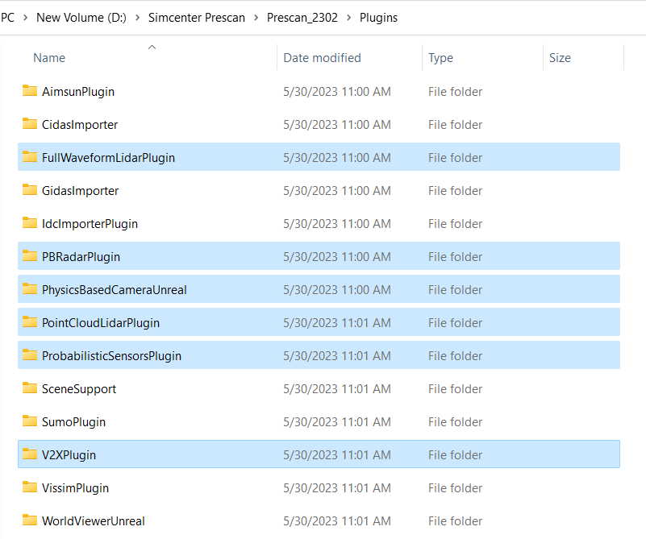
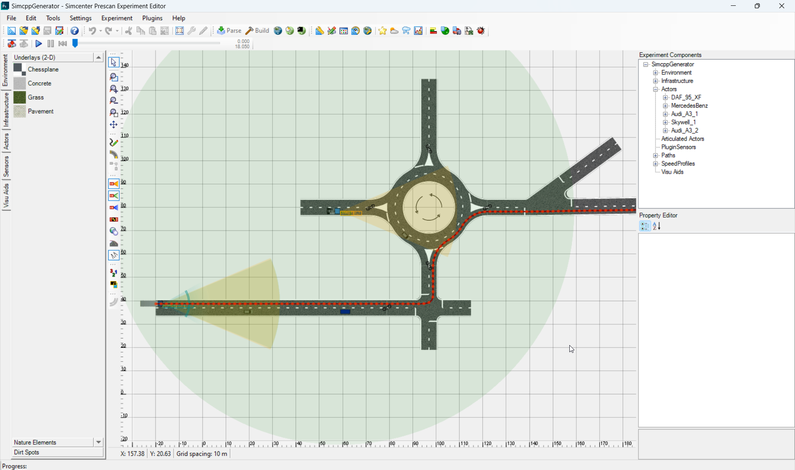
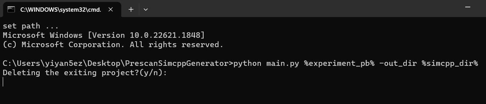
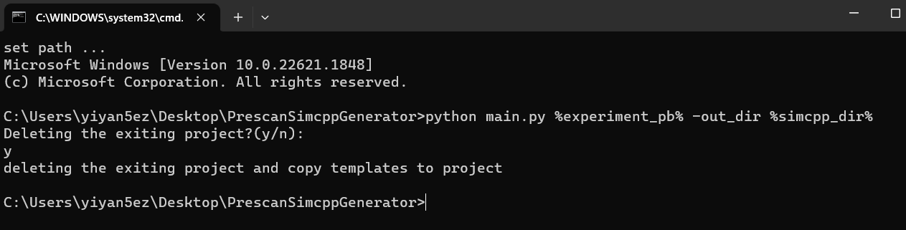
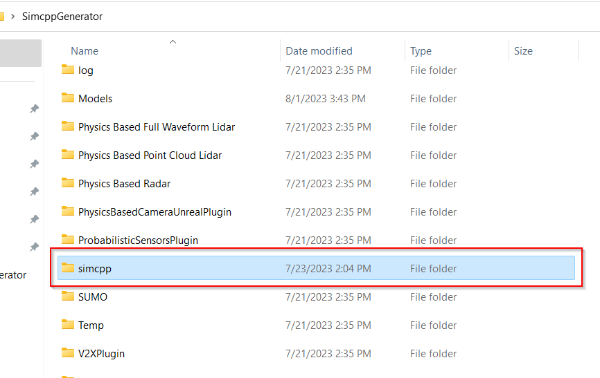
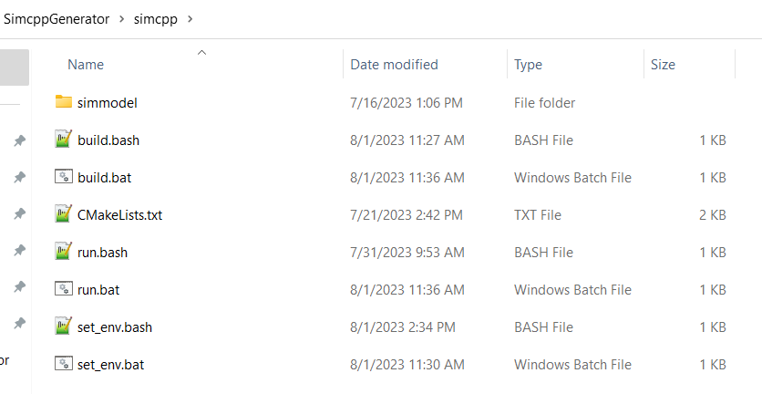
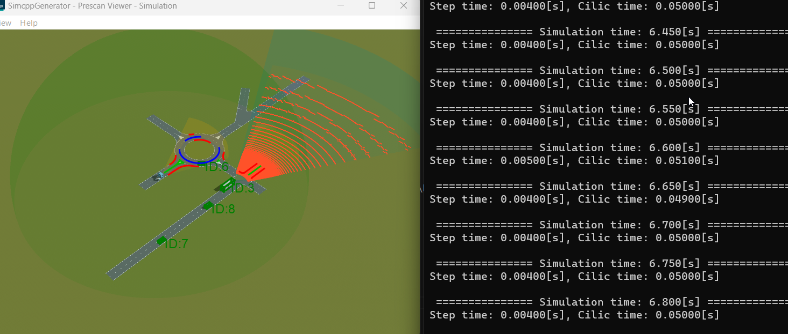
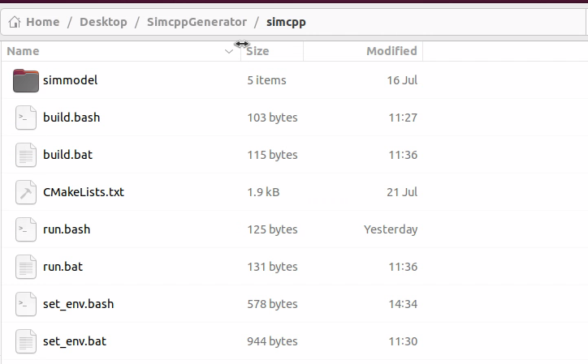
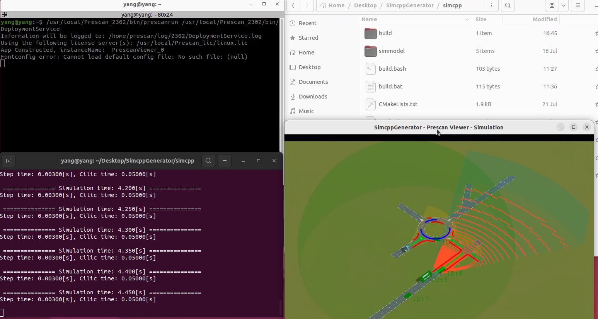
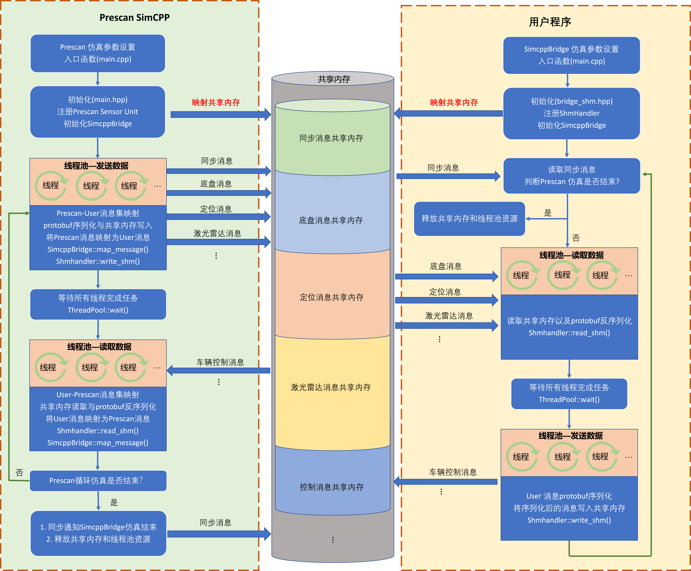

<div style="text-align: center"><span style="font-family: Arial; font-size: 20px;"><strong>—————————————————————————————</strong></span></div>

<div style="text-align: center"><span style="font-family: Arial; font-size: 20px;"><strong>欢迎使用 PrescanSimCppGenerator 1.0</strong></span></div>

<div style="text-align: center"><span style="font-family: Arial; font-size: 20px;"><strong>—————————————————————————————</strong></span></div>

---
[English Document](/README.md)

[toc]

# 项目简介
Prescan Simcpp Generator 旨在提供了一个Prescan C++ 仿真工程的代码生成器，主要根据Prescan工程的pb文件，自动生成该仿真工程所需的C++仿真代码，进而直接编译和运行整个C++仿真项目。目前支持自动生成的部分包括：
<div id="introduction"></div>

- Air Sensor
- Analytic Lane Marker Sensor
- Amesim Preconfigured Dynamics
- Detailed Camera
- ISimulationModel
- Lane Marker Sensor
- ObjectListProviderUnit
- Point Cloud Sensor
- Pyhsics-Based Fullwaveform Lidar
- Physics-Based Camera(Unreal)
  - [x] RGB
  - [ ] Control
  - [ ] Distance
  - [ ] Exposure
  - [ ] Illuminance
  - [ ] OptixFlow
  - [ ] RainOverlay  
- Pyhsics-Base Point Cloud Lidar
- StateActuatorUnit
- SelfSensorUnit
- Trajectory

# 版本说明

1. 该项目生成的Prescan C++ 代码命名空间适用于Prescan 2302 及其以后版本；
2. 该项目的代码和示例基于Prescan2302 **全功能版本**（包含Prescan所有的功能模块）进行开发和测试；
3. 该项目支持Windows 10/11和Ubuntu 20.04/22.04平台的Prescan SimCPP 的代码生成。
4. 对于任何**非全功能**版本的Prescan，需要对该项目的源代码进行相应的删改，即在源代码中删除Prescan尚未安装或者支持的功能的相应部分。

# 项目申明
该项目**非**Siemens Prescan官方发布，仅供Prescan C++用户学习和参考。

# 技术支持
==**请注意**==，针对该项目在使用过程中遇到的技术问题，有正式或试用license的Prescan的用户，请邮件联系你所在地区的Prescan技术支持人员，或者登录Siemens Support Center提交相应的技术支持请求，请勿直接发送任何邮件到Prescan官方技术支持，否则你的问题将不会得到任何答复。

# 使用指南
## 软件要求
在使用该项目时候，需要事先安装好以前软件：
* Prescan 2302 或者更高版本
* Python 3.8或者更高版本，并安装以下包：
  * pyyaml
* C/C++ 编译器(推荐使用Visual Studio 2019或者更高版本)
* CMake 3.21或者更高版本

## 变量设置
### Windows
根据你电脑Prescan和其他软件的安装情况，你需要做如下的步骤：
1. 首先更改```set_env.bat```文件中的环境变量，将Prescan安装目录下的bin目录。如果有安装Plugins，也需要将Plugin文件夹下的bin目录添加到系统```PATH```路径；
2. 然后添加Prescan CMake配置文件的路径到```Prescan_DIR```变量；
3. 如果你的系统环境变量中没有Python路径，你需要指定使用某个版本的Python，并将其添加到```PATH```变量中，如果有则忽略并删除该步骤；
4. 然后你需要将Prescan安装目录下的python、modules和Plugins几个目录添加到```PYTHONPATH```变量；
5. 将需要仿真的Prescan工程目录添加到```experiment_dir```;
6. 将需要仿真的Prescan工程的pb文件路径添加到```experiment_pb```;
7. 将SimCPP Generator生成的simcpp工程路径添加到```simcpp_dir```，建议在将自动生成的SimCPP工程放置在Prescan工程文件夹下的simcpp文件夹内，即```"%experiment_dir%\\simcpp"```

最后的环境变量设置如下所示：

```powershell
@ECHO OFF
setlocal

set "PATH=D:\Simcenter Prescan\Prescan_2302\bin;D:\Simcenter Prescan\Prescan_2302\Plugins\FullWaveformLidarPlugin\bin;D:\Simcenter Prescan\Prescan_2302\Plugins\PBRadarPlugin\bin;D:\Simcenter Prescan\Prescan_2302\Plugins\PointCloudLidarPlugin\bin;D:\Simcenter Prescan\Prescan_2302\Plugins\ProbabilisticSensorsPlugin\bin;D:\Simcenter Prescan\Prescan_2302\Plugins\V2XPlugin\bin;%PATH%"

set "Prescan_DIR=D:\Simcenter Prescan\Prescan_2302\lib\cmake"

set "PATH=D:\Python38\Scripts\;D:\Python38\;%PATH%"

set "PYTHONPATH=D:\Simcenter Prescan\Prescan_2302\python;D:\Simcenter Prescan\Prescan_2302\modules;D:\Simcenter Prescan\Prescan_2302\Plugins;%PYTHONPATH%"

set experiment_dir="C:\\Users\\yiyan5ez\\Desktop\\PrescanSimcppGenerator\\prescandemos\\SimcppGenerator"
set experiment_pb="C:\\Users\\yiyan5ez\\Desktop\\PrescanSimcppGenerator\\prescandemos\\SimcppGenerator\\SimcppGenerator.pb"
set simcpp_dir="C:\\Users\\yiyan5ez\\Desktop\\PrescanSimcppGenerator\\prescandemos\\SimcppGenerator\\simcpp"

echo set path ...
cmd
```

### Ubuntu
==**注意**==：Prescan 2307版本正式支持Ubuntu20.04系统，且包含了Windows版本下所有的基于物理建模的传感器，但不持支V2X插件。但在2307之前的版本，并不支持在Ubuntu系统下运行Physics-Based Point Cloud Lidar 和 Physics-Based Radar。因此用户在Ubuntu下使用该项目时候，需要根据自身Prescan版本以及安装的Plugins来添加环境变量。如何在Ubuntu下添加 Prescan Plugin及其PATH，请参考Prescan相关手册。在Prescan 2302的测试项目中，Ubuntu上未安装任何Prescan Plugins。

```bash
#! /usr/bin/env bash

# add prescan
export Prescan_version=Prescan_2302
export PATH=$PATH:/usr/local/${Prescan_version}/bin
export LD_LIBRARY_PATH=$LD_LIBRARY_PATH:/usr/local/${Prescan_version}/lib

# add Prescan Plugin path
#export LD_LIBRARY_PATH=$LD_LIBRARY_PATH:/usr/local/${Prescan_version}/<path_to_plugin>/bin

export Prescan_DIR=/usr/local/${Prescan_version}/lib/cmake

export PYTHONPATH=$PYTHONPATH:/usr/local/${Prescan_version}/python:/usr/local/${Prescan_version}/modules:/usr/local/${Prescan_version}/Plugins

export experiment_dir=/home/yang/Desktop/PrescanSimcppGenerator/prescandemos/SimcppGenerator
export experiment_pb=/home/yang/Desktop/PrescanSimcppGenerator/prescandemos/SimcppGenerator/SimcppGenerator.pb
export simcpp_dir=/home/yang/Desktop/PrescanSimcppGenerator/prescandemos/SimcppGenerator/simcpp
```


## 代码删减
对于安装了全功能版的Prescan来说，可直接使用该项目的源代码，否则需要对源代码进行相应的删减以匹配当前Prescan所支持的功能。全功能的版本的Prescan在安装目录中将会有一个Plugins的目录，如图所示。其中选中的这些插件有对用户开放的API。


### prescan_python_dmapi.py
首先需要删减或注释的部分在```./rename_api_namespace/prescan_python_dmapi.py```文件中，该模块导入了Prescan 2302对用户开放的所有功能的python API。


```python
import prescan.api
import prescan.api.experiment
import prescan.api.types
import prescan.api.log
import prescan.genericmodel
import prescan.internal
import prescan.assets
import prescan.assets.bufferdata
import prescan.api.air
import prescan.api.alms
import prescan.api.annotations
import prescan.api.brs
import prescan.api.camera
import prescan.api.depthcamera
import prescan.api.iss
import prescan.api.collisiondetection
import prescan.api.communication
import prescan.api.roads
import prescan.api.lidar
import prescan.api.lms
import prescan.api.objectlistprovider
import prescan.api.ocs
import prescan.api.opendrive
import prescan.api.openscenario
import prescan.api.pcs
import prescan.api.physicsbasedcameraunreal
import prescan.api.viewer
import prescan.api.radar
import prescan.api.tis
import prescan.api.trafficsignalsensor
import prescan.api.scenario
import prescan.api.trajectory
import prescan.api.ultrasonic
import prescan.api.userdata
import prescan.api.vehicledynamics
import prescan.internal.algorithm
import prescan.internal.scenario
import prescan.api.fullwaveformlidar
import prescan.api.pbradar
import prescan.api.pointcloudlidar
import prescan.api.probabilisticcamera
import prescan.api.probabilisticradar
import prescan.api.v2x
import prescan.api.roads.types
import prescan.api as prescan_api
import prescan.api.experiment as prescan_api_experiment
import prescan.api.types as prescan_api_types
import prescan.api.log as prescan_api_log
import prescan.genericmodel as prescan_genericmodel
import prescan.internal as prescan_internal
import prescan.assets as prescan_assets
import prescan.assets.bufferdata as prescan_assets_bufferdata
import AIR.python_interface.prescan.api.air as prescan_api_air
import ALMS.python_interface.prescan.api.alms as prescan_api_alms
import Annotations.python_interface.prescan.api.annotations as prescan_api_annotations
import BRS.python_interface.prescan.api.brs as prescan_api_brs
import Camera.python_interface.prescan.api.camera as prescan_api_camera
import Camera.python_interface.prescan.api.depthcamera as prescan_api_depthcamera
import Camera.python_interface.prescan.api.iss as prescan_api_iss
import CollisionDetection.python_interface.prescan.api.collisiondetection as prescan_api_collisiondetection
import Communication.python_interface.prescan.api.communication as prescan_api_communication
import GraphBasedRoads.python_interface.prescan.api.roads as prescan_api_roads
import Lidar.python_interface.prescan.api.lidar as prescan_api_lidar
import LMS.python_interface.prescan.api.lms as prescan_api_lms
import ObjectListProvider.python_interface.prescan.api.objectlistprovider as prescan_api_objectlistprovider
import OCS.python_interface.prescan.api.ocs as prescan_api_ocs
import OpenDriveImporter.python_interface.prescan.api.opendrive as prescan_api_opendrive
import OpenScenarioImporter.python_interface.prescan.api.openscenario as prescan_api_openscenario
import PCS.python_interface.prescan.api.pcs as prescan_api_pcs
import PhysicsBasedCamera.python_interface.prescan.api.physicsbasedcameraunreal as prescan_api_physicsbasedcameraunreal
import PrescanViewer.python_interface.prescan.api.viewer as prescan_api_viewer
import Radar.python_interface.prescan.api.radar as prescan_api_radar
import TIS.python_interface.prescan.api.tis as prescan_api_tis
import TrafficSignalSensor.python_interface.prescan.api.trafficsignalsensor as prescan_api_trafficsignalsensor
import Trajectory.python_interface.prescan.api.scenario as prescan_api_scenario
import Trajectory.python_interface.prescan.api.trajectory as prescan_api_trajectory
import UltraSonic.python_interface.prescan.api.ultrasonic as prescan_api_ultrasonic
import UserData.python_interface.prescan.api.userdata as prescan_api_userdata
import VehicleDynamics.python_interface.prescan.api.vehicledynamics as prescan_api_vehicledynamics
import Algorithm.python_interface.prescan.internal.algorithm as prescan_internal_algorithm
import Trajectory.python_interface.prescan.internal.scenario as prescan_internal_scenario
import FullWaveformLidarPlugin.modules.fullwaveformlidar.python_interface.prescan.api.fullwaveformlidar as prescan_api_fullwaveformlidar
import PBRadarPlugin.modules.pbradar.python_interface.prescan.api.pbradar as prescan_api_pbradar
import PointCloudLidarPlugin.modules.pointcloudlidar.python_interface.prescan.api.pointcloudlidar as prescan_api_pointcloudlidar
import ProbabilisticSensorsPlugin.modules.ProbabilisticCamera.python_interface.prescan.api.probabilisticcamera as prescan_api_probabilisticcamera
import ProbabilisticSensorsPlugin.modules.ProbabilisticRadar.python_interface.prescan.api.probabilisticradar as prescan_api_probabilisticradar
import V2XPlugin.modules.v2x.python_interface.prescan.api.v2x as prescan_api_v2x
import GraphBasedRoads.python_interface.prescan.api.roads.types as prescan_api_roads_types
```

但当用户安装的Prescan不支持某些功能API的时候，需要手动将对应的代码导入部分注释或删除掉。如果用户没有安装的Prescan没有Plugins或者Plugins不全，则需要注释掉相应的代码。例如，用户没有安装Plugins或者缺少Plugins中的Physics-Based Camera/Lidar/Radar或Probabilistic Radar/Camera或V2X，则需要注释或删除对应的API导入代码。

如缺少v2x，注释或删除：

```python
#import prescan.api.v2x
#import V2XPlugin.modules.v2x.python_interface.prescan.api.v2x as prescan_api_v2x
```

如缺少physicsbasedcameraunreal，注释或删除：

```python
#import prescan.api.physicsbasedcameraunreal
#import PhysicsBasedCamera.python_interface.prescan.api.physicsbasedcameraunreal as prescan_api_physicsbasedcameraunreal
```

如缺少fullwaveformlidar，注释或删除：

```python
#import prescan.api.fullwaveformlidar
#import FullWaveformLidarPlugin.modules.fullwaveformlidar.python_interface.prescan.api.fullwaveformlidar as prescan_api_fullwaveformlidar
```

如缺少pbradar，注释或删除：

```python
#import prescan.api.pbradar
#import PBRadarPlugin.modules.pbradar.python_interface.prescan.api.pbradar as prescan_api_pbradar
```

如缺少pointcloudlidar，注释或删除：

```python
#import prescan.api.pointcloudlidar
#import PointCloudLidarPlugin.modules.pointcloudlidar.python_interface.prescan.api.pointcloudlidar as prescan_api_pointcloudlidar
```

如缺少probabilisticcamera/radar，注释或删除：

```python
#import prescan.api.probabilisticcamera
#import prescan.api.probabilisticradar
#import ProbabilisticSensorsPlugin.modules.ProbabilisticCamera.python_interface.prescan.api.probabilisticcamera as prescan_api_probabilisticcamera
#import ProbabilisticSensorsPlugin.modules.ProbabilisticRadar.python_interface.prescan.api.probabilisticradar as prescan_api_probabilisticradar
```
如缺少整个Plugins文件夹，则删除上述所有代码。另外，Prescan目前尚未支持Linux平台下的v2x模块，所以用户在Ubuntu上使用该项目的时候，必须注释或删除v2x相关的API导入。


### sensors and generators
在删除或注释掉对应plugin的API导入后，还需要在```sensors```和```generator```文件夹内删除对应的传感器模块。例如：如果在```prescan_python_dmapi.py```中注释或者删除掉了```pointcloudlidar```的导入，则必须在```sensors```和```generator```文件中分别删除```Pointcloudlidar.py```和```PointcloudlidarGenerator.py```。

## 使用步骤
==在进行正式SimCPP代码生成前，确保已经根据Prescan实际安装情况和支持的功能，按上述要求完成了SimCPP Generator源代码的删减==。
SimCPP Generator可以在Windows或Ubuntu上分别为Prescan工程自动生成SimCPP代码。但考虑到Prescan在Ubuntu上安装Plugins的时候具有一定的灵活性，不同的用户可能安装到不同的目录或者命名不同的文件夹。所以，如果要在Ubuntu上使用到Prescan Plugins的一些功能，建议直接在Windows上生成SimCPP然后拷贝到Ubuntu上编译运行。

### Windows
1. 首先创建或打开一个Prescan工程，我们在该项目中已经包含了一个示例工程，在项目的```./prescandemos```文件夹下，工程名称为```SimcppGenerator```。
2. 在Prescan GUI中创建场景，添加道路、建筑、车辆等，设置仿真，然后给车辆添加运动轨迹或者AmesimPreconfigedDynamics，最后给感兴趣的车辆添加传感器（[支持自动生成SimCPP代码的传感器类型](#introduction)）；

3. 在SimCPP generator中修改```set_env.bat```文件中的环境变量，例如，将该项目文件夹位于```C:\\Users\\yiyan5ez\\Desktop\\PrescanSimcppGenerator```时候，以下路径改为Prescan示例工程路径、pb文件以及期望把生成的Simcpp工程放置的路径:
    ```powershell
    set experiment_dir="C:\\Users\\yiyan5ez\\Desktop\\PrescanSimcppGenerator\\prescandemos\\SimcppGenerator"
    set experiment_pb="C:\\Users\\yiyan5ez\\Desktop\\PrescanSimcppGenerator\\prescandemos\\SimcppGenerator\\SimcppGenerator.pb"
    set simcpp_dir="C:\\Users\\yiyan5ez\\Desktop\\PrescanSimcppGenerator\\prescandemos\\SimcppGenerator\\simcpp"
    ```
4. 双击```set_env.bat```即可打开一个cmd窗口，输入：
    ```powershell
    python main.py %experiment_pb% -out_dir %simcpp_dir%
    ```
    第一个位置参数```%experiment_pb%```为Prescan工程的pb文件，第二个可选参数```-out_dir```表示将自动生成的SimCPP工程拷贝到```%simcpp_dir%```路径下。如果```%simcpp_dir%```路径已经存在，则运行上述代码的时候将会提示是否删除已经存在的simcpp工程。
    
    输入'y'表示同意删除，'n'或其他字符不删除并退出程序，如图显示SimCPP创建成功。
    
5. 在对应的Prescan工程目录下，即可看到一个simcpp文件夹，里面包含了整个工程的SimCPP程序。
    

    进入该文件夹内，可以看到如下文件结构：

    

    双击```set_env.bat```即可打开一个cmd窗口，输入：
    ```powershell
    build.bat
    ```
    如果build成功，则可以看到如下输出内容：
    ```powershell
    -- Selecting Windows SDK version 10.0.17763.0 to target Windows 10.0.22621.
    -- The CXX compiler identification is MSVC 19.20.27508.1
    -- Detecting CXX compiler ABI info
    -- Detecting CXX compiler ABI info - done
    -- Check for working CXX compiler: c:/apps/MVS16/VC/Tools/MSVC/14.20.27508/bin/Hostx64/x64/cl.exe - skipped
    -- Detecting CXX compile features
    -- Detecting CXX compile features - done
    -- Found Prescan 2023.1.0 at D:/Simcenter Prescan/Prescan_2302/lib/cmake
        Plugins found:
            - Prescan::FullWaveformLidar
            - Prescan::PBRadar
            - Prescan::PointCloudLidar
            - Prescan::ProbabilisticSensors
            - Prescan::v2x
    -- Generating helper scripts for demo: SimCppProject
    -- Experiment directory set to: C:/Users/yiyan5ez/Desktop/SimcppGenerator
    -- PrescanRootDIR D:/Simcenter Prescan/Prescan_2302
    -- Configuring done
    -- Generating done
    -- Build files have been written to: C:/Users/yiyan5ez/Desktop/SimcppGenerator/simcpp/build
    Microsoft (R) Build Engine version 16.0.462+g62fb89029d for .NET Framework
    Copyright (C) Microsoft Corporation. All rights reserved.

      Checking File Globs
      Checking Build System
      Building Custom Rule C:/Users/yiyan5ez/Desktop/SimcppGenerator/simcpp/CMakeLists.txt
      main.cpp
      cnpy.cpp
      Generating Code...
      SimCppProject.vcxproj -> C:\Users\yiyan5ez\Desktop\SimcppGenerator\simcpp\build\Release\SimCppProject.exe
      Building Custom Rule C:/Users/yiyan5ez/Desktop/SimcppGenerator/simcpp/CMakeLists.txt
    ```
    继续双击set_env.bat即可打开一个cmd窗口，输入：
    ```powershell
    run.bat
    ```
    Prescan将会开始仿真：
    
    如果需要更改仿真时间，打开```run.bat```：
    ```powershell
    prescanrun %simcpp_dir%\\build\\Release\\SimCppProject.exe %experiment_pb% 10
    ```
    其中，数字10表示仿真进行10s。

### Ubuntu
1. 步骤同Windows；
2. 步骤同Windows；
3. 将Prescan工程和Simcpp Generator项目文件夹都拷贝到Ubuntu；
4. 同理，在SimCPP generator中修改```set_env.bash```文件中的环境变量，例如以下路径改为所创建的Prescan工程路径、pb文件以及期望把生成的Simcpp工程放置的路径:
    ```bash
    export experiment_dir=/home/yang/Desktop/PrescanSimcppGenerator/prescandemos/SimcppGenerator
    export experiment_pb=/home/yang/Desktop/PrescanSimcppGenerator/prescandemos/SimcppGenerator/SimcppGenerator.pb
    export simcpp_dir=/home/yang/Desktop/PrescanSimcppGenerator/prescandemos/SimcppGenerator/simcpp
    ```
5. 在当前SimCPP generator项目文件夹中打开一个Terminal，依次输入：
    ```shell
    source set_env.bash
    ```
    ```shell
    python3 main.py $experiment_pb -out_dir $simcpp_dir
    ```
    运行成功的话，同样将在Prescan工程文件夹下找到simcpp文件夹。
    
    
6. 在simcpp文件夹内打开一个Terminal，依次输入：
    ```shell
    source set_env.bash
    ```
    ```shell
    bash build.bash
    ```
    如果build成功将会看到如下输出：
    ```shell
    -- The CXX compiler identification is GNU 11.4.0
    -- Detecting CXX compiler ABI info
    -- Detecting CXX compiler ABI info - done
    -- Check for working CXX compiler: /usr/bin/c++ - skipped
    -- Detecting CXX compile features
    -- Detecting CXX compile features - done
    -- Found Prescan 2023.1.0 at /usr/local/Prescan_2302/lib/cmake
        Plugins found: <NONE>
    -- Generating helper scripts for demo: SimCppProject
    -- Experiment directory set to: /home/yang/Desktop/SimcppGenerator
    -- Configuring done
    -- Generating done
    -- Build files have been written to: /home/yang/Desktop/SimcppGenerator/simcpp/build
    [ 33%] Building CXX object CMakeFiles/SimCppProject.dir/simmodel/main.cpp.o
    In file included from /home/yang/Desktop/SimcppGenerator/simcpp/simmodel/simmodel/simmodel.h:21,
                    from /home/yang/Desktop/SimcppGenerator/simcpp/simmodel/main.cpp:23:
    /home/yang/Desktop/SimcppGenerator/simcpp/simmodel/utils/threadpool.h: In function ‘double prescan::utils::get_timestamp()’:
    /home/yang/Desktop/SimcppGenerator/simcpp/simmodel/utils/threadpool.h:56:8: warning: ‘int ftime(timeb*)’ is deprecated: Use gettimeofday or clock_gettime instead [-Wdeprecated-declarations]
      56 |   ftime(&now);
          |   ~~~~~^~~~~~
    In file included from /home/yang/Desktop/SimcppGenerator/simcpp/simmodel/utils/threadpool.h:38,
                    from /home/yang/Desktop/SimcppGenerator/simcpp/simmodel/simmodel/simmodel.h:21,
                    from /home/yang/Desktop/SimcppGenerator/simcpp/simmodel/main.cpp:23:
    /usr/include/x86_64-linux-gnu/sys/timeb.h:29:12: note: declared here
      29 | extern int ftime (struct timeb *__timebuf)
          |            ^~~~~
    [ 66%] Building CXX object CMakeFiles/SimCppProject.dir/simmodel/utils/cnpy.cpp.o
    [100%] Linking CXX executable SimCppProject
    /usr/bin/ld: warning: /usr/local/Prescan_2302/lib/libplatform.so has a program header with invalid alignment
    /usr/bin/ld: warning: /usr/local/Prescan_2302/lib/libpimp.so has a program header with invalid alignment
    /usr/bin/ld: warning: /usr/local/Prescan_2302/lib/libfederate_sdk.so has a program header with invalid alignment
    /usr/bin/ld: warning: /usr/local/Prescan_2302/lib/libpssettings.so has a program header with invalid alignment
    /usr/bin/ld: warning: /usr/local/Prescan_2302/lib/libmoduleloader.so has a program header with invalid alignment
    /usr/bin/ld: warning: /usr/local/Prescan_2302/lib/libprtl.so has a program header with invalid alignment
    /usr/bin/ld: warning: /usr/local/Prescan_2302/lib/libvislibrary.so has a program header with invalid alignment
    [100%] Built target SimCppProject
    ```
    然后可以继续运行```run.bash```执行仿真。但在仿真之前，==请确保Prescan DeploymentService已经运行起来==。同样，在simcpp中打开一个Terminal，然后依次输入：
    ```shell
    source set_env.bash
    ```
    ```shell
    bash run.bash
    ```
    即可运行Prescan仿真，如图所示：
    


# 代码详解
## 获取数据


# 进阶应用
## SimCppBridge
该项目中包含了一个Simcpp和C++或Python进程通过共享内存进行通信的示例。Prescan将感知数据从Simcpp中发送到共享内存，工作流程如下：

首先
